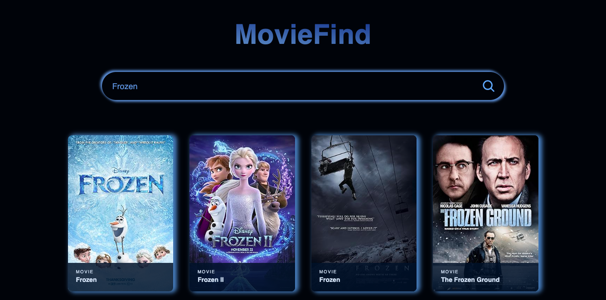

# MovieFind
Catalogue of movies, TV series and games based on single scalable web page utilizing reusability of components provided by **ReactJS** library.

## Development tools
> Node.js   [Download here](http://nodejs.org)

> ReactJS   [Documentation here](https://legacy.reactjs.org/)

## Installation
| Description | Command |
| ----------- | ------- |
| Clone this repository| <ins>Option 1</ins> Download as a `zip` file <ins>Option 2</ins> `git clone git@github.com:litvem/movie_find.git`|
| Open the repo in JavaScript IDE| |
| Start the server | `npm start` |

